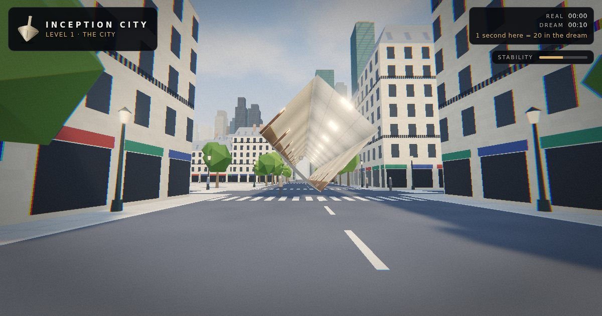
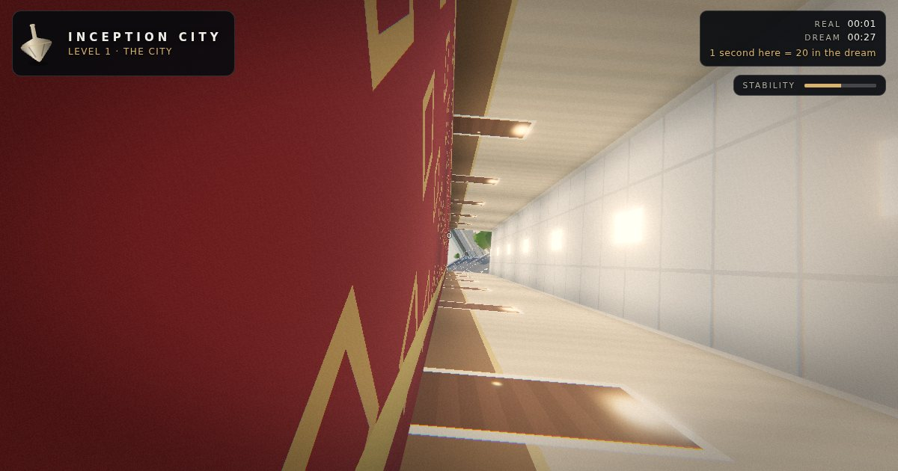
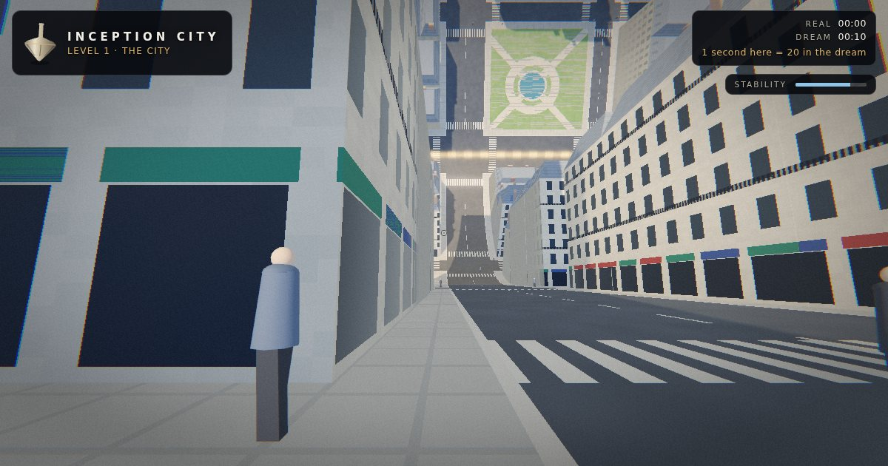
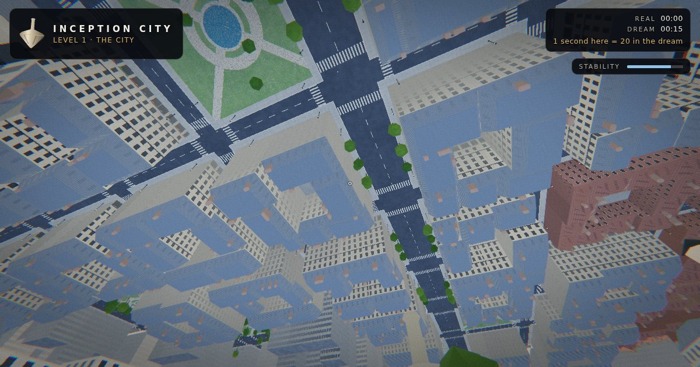
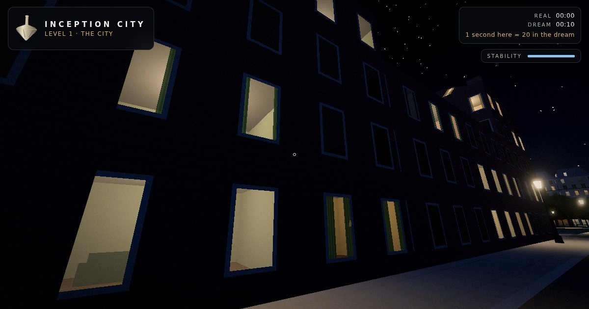
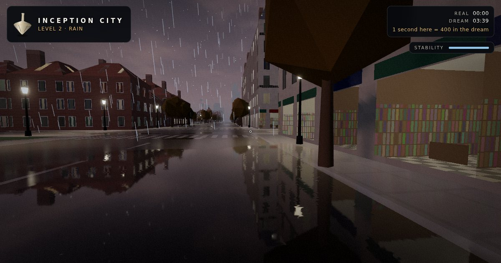
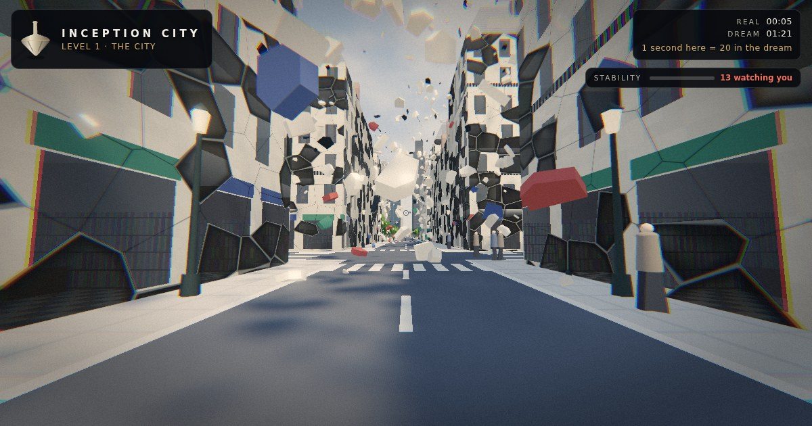
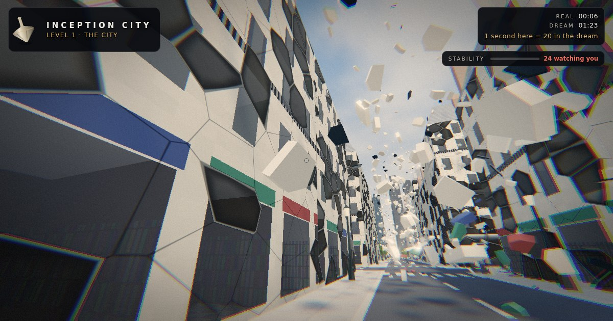

# Inception City

**A folding, dreaming city you can bend with your hands and walk through on foot.**

**[Play it in your browser](https://msavastano.github.io/Inception-City/)** · [Read the city plan](docs/CITY_PLAN.md)


Inception City is an endless, procedurally generated Paris printed on a sheet of fabric. Every street is a hinge. Grab the city and fold it until whole districts hang upside down in the sky, then drop to street level and walk up the curl and onto the ceiling, because in a dream gravity follows the street. Ride a folding street up over the city, or step into the hotel corridor that turns like a barrel. Fold too hard and the dream's projections turn to stare at you. Go deeper and time stretches, snow falls, and in Limbo the city crumbles into the sea.

It runs in any modern browser with WebGL 2, on desktop and on phones. Nothing is downloaded but code: every facade, cobble, cloud and sound is generated from a seed.

| Walking towards a fold | Walking up the curl |
| --- | --- |
|  |  |
| **City in a Box** | **The Scroll** |
|  |  |
| **The rotating hallway** | **Inside, standing on the wall** |
|  |  |
| **Riding the fold** | **At the top** |
|  |  |
| **Rooms behind the windows** | **Wet streets in the Rain** |
|  |  |
| **The café explosion** | **Hanging in slow motion** |
|  |  |


## What you can do

**Architect mode** looks down on the city like a model on a table.

- **Fold:** press on a street and drag. The hinge forms under the cursor, and the further you drag, the further the city bends, up to a full 180°. Creases snap to streets. Hold Shift to fold downwards.
- **Raise:** paint over blocks to grow or shrink the buildings.
- **Dreamscapes:** six one-click compositions: *The Paris Fold*, *Double Fold*, *The Scroll*, *Escher Steps*, *City in a Box* and *The Hallway*.
- **Sculpt after the fact:** every fold has its own angle slider, and Undo removes the newest.
- **Share:** the whole dream (seed, level, time of day and folds) fits in the link.

**Dream Walk** puts you on the sidewalk in first person.

- Walk and run through the streets, and fold the street ahead of you to watch the road rise into a wall, then climb it.
- **Ride the fold (E):** the street you are standing on folds up and over the city and carries you with it, until you hang upside down 96 m above the districts behind you.
- **The rotating hallway (H):** a hotel corridor rises around you and turns like a barrel. Its walls carry you up until you slide onto the next one, so you end up running along the walls and the ceiling. Walk out of either end to get back to the street.
- Trees, lamps, buildings and the monument are solid. The projections walk the sidewalks with you.
- Press K for the kick: every fold collapses at once with a ripple and a BRAAAM, and you wake up a level.
- **The café explosion:** fold too hard and stability hits zero. The facades around you crack and blow out into the street, then the dream slows almost to a stop and the stone, glass and shop awnings hang in the air while you walk among them, until the kick arrives on its own. It happens in architect mode too, around the spot you are looking at.

**Dream levels** change everything at once: palette, weather, colour grade, ambient drone and time dilation.

| Level | | Time |
| --- | --- | --- |
| 1 · The City | Clear Paris morning | ×20 |
| 2 · Rain | Dusk, wet streets that mirror the city, restless projections | ×400 |
| 3 · Snow | White silence | ×8,000 |
| Limbo | Ash, a grey sea, the city sinking into it | ∞ |

## Controls

| | Architect | Dream Walk |
| --- | --- | --- |
| Move | Right-drag to orbit, middle-drag to pan, scroll to zoom (the Orbit tool puts orbit on the left button) | WASD or arrows, Shift to run, Space to jump |
| Look | Same as move | Mouse (click to capture it), or drag |
| Fold | Drag across a street with the Fold tool (F) | F folds the street ahead up, V drops it away, E rides the street you stand on |
| Other | R raise brush, O orbit, Z undo, H the Hallway dreamscape, double-click to fly to a spot | H raises or lets go of the rotating hallway, Esc to pause, Q to wake up |
| Anywhere | Tab switches mode, K is the kick, 1 to 4 pick the level, M mutes | |

On touch screens: in architect mode one finger folds or paints (or orbits with the Orbit tool) and two fingers zoom and pan. In Dream Walk a left-thumb stick walks, dragging anywhere else looks, and buttons jump, fold, ride, raise the hallway, kick and wake.

### Link parameters

`#s=` seed, `#l=` level (1 to 4), `#t=` time of day (0 is noon, 1 is midnight), `#f=` folds, and `#q=` quality (`low`, `medium`, `high` or `ultra`). The Share button writes all of them for you.

## How it works

The short version: **everything is simulated on the flat sheet, and folding happens only in the vertex shader.**

- **Fabric space and world space.** Generation, collision, the crowd, the dreamer's footsteps and streaming all live on the unfolded sheet. A fold is a rigid transform that depends only on how far a point lies past the hinge, so it is continuous, it preserves distances along the street (which is why you can walk up a curl with no special code), and nested folds compose like paper. Crossing folds cut the sheet like the corners of a paper box. The maths is in [`src/core/fold.ts`](src/core/fold.ts), mirrored in GLSL in [`src/city/shaders.ts`](src/city/shaders.ts), and pinned by [`tests/fold.test.ts`](tests/fold.test.ts).
- **About eleven draw calls for the whole city.** Each kind of object is one instanced mesh, and each streamed 256 m chunk owns a fixed slab of instances, so loading a chunk is one partial buffer upload and the draw-call count never grows.
- **Streaming after folding.** Chunks are chosen by their distance *after* folding, so the districts hanging overhead are loaded even though they are far away on the sheet.
- **No textures.** Facades, roofs, streets, parks, snow, puddles, crease lines and the glowing underside of a fold are all painted procedurally in shaders.
- **Rooms behind the windows.** Each window is a hole into a room traced in the facade shader (interior mapping): walls, floor, a ceiling lamp, curtains and furniture shift with parallax as you walk past, with no extra geometry. Far away a window fades back to a flat pane.
- **Wet streets.** In the Rain the street is a mirror. The city is drawn a second time from below the street at reduced resolution, and the ground looks it up: sharp in puddles that ripple with raindrops, smeared into long streaks on wet asphalt. On Low quality the street lamps' reflections are traced analytically instead. See [`src/fx/reflection.ts`](src/fx/reflection.ts).
- **GPU picking.** Clicking on a folded city renders a single pixel of fabric coordinates under the cursor, so a fold can start on a wall or a ceiling.
- **The café explosion.** At zero stability a blast wave runs through the building shader, cracking each wall into cells and opening some of them onto the rooms behind, while a few thousand instanced shards leave the same walls at the same moments. The dream's clock then runs at about a sixth of real time, but the dreamer keeps real time. See [`src/world/collapse.ts`](src/world/collapse.ts).
- **One exception to the rule.** Inside the rotating hallway, gravity points at the real ground. The dreamer is simulated in the corridor's own spinning frame, with friction that holds until the floor tilts past about 31°, and the camera's up eases toward whichever wall is underfoot. See [`src/world/hallway.ts`](src/world/hallway.ts).
- **Adaptive quality.** Four tiers trade resolution, shadows, bloom, the wet-street mirror, view distance and crowd size, chosen from the device and adjusted to hold the frame rate.

The [city plan](docs/CITY_PLAN.md) covers the districts, the rules of the dream, the full fold algebra, the scaling strategy and the roadmap (multiplayer through a shared fold log, WebGPU and WebXR).

## Run it locally

```bash
npm install
npm run dev          # http://localhost:5173
npm test             # fold algebra, generator, hallway, mirror and café explosion tests
npm run build        # static site in dist/
npm run build:single # one self-contained HTML file in dist-single/
```

Built with TypeScript, [Three.js](https://threejs.org) and [Vite](https://vite.dev). Every push to `main` is tested, built and published to GitHub Pages by [`.github/workflows/deploy.yml`](.github/workflows/deploy.yml).

## Project layout

```
src/
  core/    fold algebra, grid constants, seeded noise
  city/    chunk generator, shaders, materials, slab allocator, streamer
  world/   sky and weather, dream levels, the projections crowd, the rotating hallway, the café explosion
  modes/   architect, dream walk, riding the fold, dreamscape presets
  fx/      GPU picking, procedural audio, post-processing, the wet-street mirror
  ui/      styles and the HUD totem
tests/     fold, generator, hallway, ride, mirror and café explosion tests
docs/      the city plan and screenshots
```

## License

MIT
