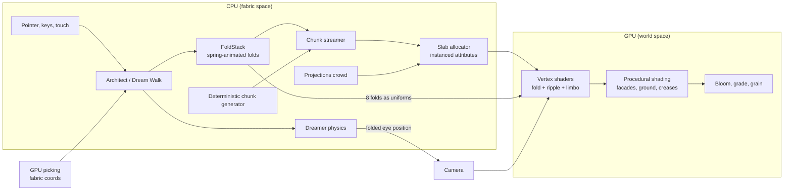

# Inception City: the plan

> "You create the world of the dream. You bring the subject into that dream, and they fill it with their subconscious."

This document is the world bible and the engineering plan in one place. The first half describes the city as a place: its districts, the rules of the dream and the two ways to be in it. The second half explains how it is built so that it can keep growing without slowing down.

---

## 1. The idea in one paragraph

Inception City is a Paris-like city printed on a sheet of fabric. Every street is a potential hinge. An architect can grab the city and fold it, rolling whole districts up into the sky until they hang upside down overhead, and a dreamer can walk through the result on foot, up the curl and onto the ceiling, because gravity in a dream follows the street, not the planet. Push the dream too far and its projections notice you. Go deeper and time stretches, the weather turns, and eventually the city crumbles into the sea of Limbo.

---

## 2. The city

### 2.1 Layout

The city is an endless Manhattan-style grid laid out in fabric space (the flat sheet before any folding).

| Element | Size | Notes |
| --- | --- | --- |
| Block | 64 m | Street centrelines every 64 m in both directions |
| Street | 14 m kerb to kerb | 3 m sidewalks either side |
| Boulevard | 24 m | Every fourth line, tree-lined on both sides |
| Chunk | 256 m (4 × 4 blocks) | The unit of generation, streaming and memory |

Because hinges snap to street lines, a fold always lands in the open, never through a building. That one constraint is what makes folds read as architecture rather than as damage.

### 2.2 Districts

Districts are not hand-placed. Two low-frequency noise fields ("downtown" and "old town") paint the grid, so every seed produces a different but coherent city.

- **The Circus.** The four blocks around the origin form a round plaza with the city's monument at its centre: a 30 m spinning top, balanced on its point. It is the dream's anchor. Every fold is ordered relative to it, and the HUD totem mirrors it: steady when the dream is stable, wobbling when it is not.
- **Haussmann core.** Six-storey limestone perimeter blocks with shopfronts and coloured awnings, continuous wrought-iron balconies on the second and fifth floors, zinc mansard roofs with dormers, and forests of chimney pots. This is the Paris of the film.
- **Old town brick.** Narrower lots, red pitched roofs, white window trim, one chimney each. Patches of it break up the stone.
- **Downtown.** Glass curtain walls and modernist concrete towers with setback crowns, away from the centre. When the city folds, these are the stalactites hanging from the sky.
- **Parks and plazas.** Green blocks follow their own noise field, so they cluster into something like a Tuileries rather than scattering as single squares.
- **The Limbo shore.** On the deepest level the edges of the city sink. Beyond about 260 m from the Circus, towers lean and slide into a grey sea, and past 820 m there is only water and ruins.

### 2.3 Street furniture

Boulevards carry plane trees. Every street has lamps on both sides at a fixed rhythm (every 32 m), which at night lay pools of warm light on the pavement. Zebra crossings mark every intersection, and they double as the projections' crossing points.

---

## 3. The rules of the dream

1. **Streets are hinges.** Any street can become a fold line. A fold has a hinge, a direction, an angle and a radius. Up to eight folds can be alive at once.
2. **Gravity follows the fabric.** Anything standing on the city (a dreamer, a projection, a tree) is attached to the sheet. Walk towards a fold and the road simply rises ahead of you into a wall and then a ceiling, and you keep walking. The one exception is the rotating hallway (4.3): inside it, gravity points down at the real ground, and the corridor turns around you.
3. **Paper physics.** Parallel folds nest: a fold further from the Circus is carried along by a nearer one, like rolling up a carpet. Crossing folds cut the sheet the way you cut the corners out of paper before folding it into a box, so nothing has to stretch.
4. **The dream pushes back.** Every fold costs stability. Fast, violent folding costs more. The totem wobbles, the picture shakes and splits into colour fringes, and the projections start to stare.
5. **Projections defend the dreamer's mind.** Calm projections walk the sidewalks. As stability falls they stop and turn to look at you. When it collapses they hunt. If they reach you, you are kicked out.
6. **The kick.** A kick (the K key, or being caught) collapses every fold at once with a ripple through the ground and a BRAAAM. In first person, a kick also wakes you up one level. Afterwards the dream is calm: stability is back to full while the city unwinds, and the projections forget you.
7. **The café explosion.** If stability reaches zero, the dream comes apart around the dreamer. A blast runs out through the walls, cracking them and blowing pieces of stone, glass and shop awning out into the street, and then the dream slows almost to a stop: the debris hangs in the air while the dreamer can still walk among it. About four seconds later the kick arrives on its own (5.7).
8. **Time dilates with depth.** Each level runs faster than the one above. The HUD shows real time next to dream time.

### 3.1 Dream levels

| Level | Name | Dream seconds per real second | Mood |
| --- | --- | --- | --- |
| 1 | The City | 20 | Clear Paris morning, warm stone, saturated grade |
| 2 | Rain | 400 | Dusk, wet streets and puddles that mirror the city, cold grade, autumn trees, restless crowd |
| 3 | Snow | 8,000 | White silence, snow on every roof and pavement, a lower drone |
| 4 | Limbo | ∞ | Washed-out colour, falling ash, a city crumbling into the sea |

Each level has its own palette for day and night, weather, colour grade and ambient drone pitch. The time-of-day slider runs from noon to midnight on every level, and at night roughly a third of the windows light up. Up close each lit window opens onto a room (5.5).

---

## 4. Two ways to be in the city

### 4.1 Architect (third person)

The architect looks down on the city like a model on a table.

- **Fold:** press on a street and drag. The hinge forms under your cursor, perpendicular to the direction you drag. The further you drag, the further it bends, up to 180°. With *Snap creases to streets* on, the hinge locks to the nearest street and the direction locks to the grid. Hold Shift to fold downwards into the ground.
- **Raise:** paint over blocks to grow or shrink buildings. Edits stick to the block even when it streams out and back in.
- **Orbit:** a plain camera, for looking without touching anything.
- **Dreamscapes:** six presets that each make a point about the fold algebra, or break it.
  - *The Paris Fold:* the film's shot. Half the city hangs overhead.
  - *Double Fold:* two opposite curls, two skies made of streets.
  - *The Scroll:* four nested quarter-folds roll the city up like a carpet.
  - *Escher Steps:* alternating up and down folds turn districts into a staircase.
  - *City in a Box:* four walls stand up, and the crossing-fold cut keeps the corners clean.
  - *The Hallway:* a hotel corridor turning like a barrel on the boulevard. Walk in at either end.
- **Fold list:** every fold is listed with its direction and a live angle slider, so you can sculpt after the fact. Undo removes the newest fold.
- **Share:** the whole dream (seed, level, time, folds and quality) fits in the URL hash, so a link reproduces exactly what you see.

### 4.2 Dream Walk (first person)

The dreamer is dropped onto a sidewalk at street level.

- WASD or arrows to walk, Shift to run, Space to jump. Mouse look with pointer lock, or drag to look where pointer lock is not available.
- **F** folds the street ahead of you upwards, so you can watch the road rise into a wall and then walk up it.
- **V** drops the street ahead away into a downward fold.
- **E** rides the fold: the street you are standing on folds up and over the city and carries you with it, until you hang upside down 96 m above the districts behind you. **E** again lowers you back down.
- **H** raises the rotating hallway around you on the nearest street. Press it again, or kick, to let it go.
- **K** is the kick. **Q** wakes you up into architect mode. **Esc** pauses.
- On touch screens, a left-thumb stick walks, dragging anywhere else looks, and on-screen buttons jump, fold, ride, raise the hallway, kick and wake.
- Buildings, trees, lamps and the monument are solid. Footsteps follow your pace.

Switching between the two (Tab) is a camera flight, not a cut: the architect's view swoops down to the dreamer's eye, and back up again.

### 4.3 The rotating hallway

The hotel corridor from the film: 7 m square, 64 m long, red carpet, doors every 8 m. It rises out of the street, hangs with its axis just high enough that its corners clear the ground, and turns like a barrel. The spin is not steady. It follows a few incommensurate sine waves, so it surges and slackens like a van swerving on the level above.

It is the one place where gravity does not follow the fabric. The dreamer inside is simulated in the corridor's own frame with real gravity pointing at the ground:

- **Three frames.** Fabric (where the corridor sits on the sheet), the corridor frame carried through any folds at the corridor's centre (so a hallway on a folded street hangs at the fold's angle), and spin space, the corridor frame turned by the current angle, in which the walls never move.
- **Walls carry you.** A wall you stand on moves you with it exactly, so a slow turn walks you up the floor. Static friction holds until the floor tilts past about 31°, then you slide into the corner and onto the next wall, which becomes the floor.
- **The camera follows the wall.** The view's up eases toward the wall you are standing on, so the corridor stays steady and the world outside the open ends turns instead. In the air it swings back toward the real sky.
- **Ends are open.** Walk out of either end and you drop back onto the street, carrying your speed. Walk into an open end and the corridor takes you in.

The physics is pinned by `tests/hallway.test.ts`: standing still, a minute of tumbling that never leaves the walls and visits all four, the grip-then-slide angle, and walking out.

### 4.4 Riding the fold

**E** turns the fold algebra into a lift. The hinge goes on the first street at least π·48 + 12 m behind you, with the page facing forward and a 48 m radius. That distance matters: everything closer than π·R to the hinge is wrapped around the curl, everything beyond it is the rigid page. So you never ride the bend itself; you stand on a flat street that swings up and over like a turning page, and at 180° you are upside down at exactly 2R = 96 m, looking up at the city below. The fold uses a slower spring than F, the field of view widens while it moves, and gravity following the fabric means you can walk around up there.

---

## 5. How it is built

The stack is TypeScript, Three.js (WebGL 2) and Vite, with Vitest for the maths. There are no textures and no models to download. Every brick, window, awning, cobble, cloud and sound is generated in code from the seed.

### 5.1 The key idea: fabric space and world space

Everything is simulated on the flat sheet (fabric space): generation, collision, the crowd, the dreamer's footsteps and the streaming decisions. Folding is a pure presentation transform, applied in the vertex shader on the GPU, with an exact CPU mirror for the few things that need world positions (the camera, picking, and deciding what is close enough to load).

This separation is what makes the whole thing tractable. The crowd does not know the city is folded. The dreamer's physics is the physics of walking on a flat street. Folding a district costs nothing on the CPU, because nothing on the CPU moves.

### 5.2 The fold algebra

A fold has a hinge point **h**, a unit normal **n** (pointing at the side that moves), an angle θ and a radius R. For a fabric point at distance d = (p − h)·n past the hinge, the fold is a rigid transform:

```
M(d) = T(C) · Rot_n(a) · T(−C) · T(−min(d, L)·n)

a = sign(θ) · min(d / R, |θ|)      the bend so far
L = R · |θ|                          the length of the curl
C = h + sign(θ) · R · up             the centre of the curl cylinder
```

Points before the hinge do not move. Points inside the curl wrap around a cylinder of radius R. Points past the curl continue as a rigid flat sheet at angle θ. Three properties follow:

- **Continuity.** M is continuous in d, so the sheet never tears.
- **Isometry.** The street surface is mapped without stretching. A 100 m walk on the flat is a 100 m walk on the folded city, which is why the dreamer can walk up a curl without any special-case code.
- **Composability.** Folds are sorted by their distance from the Circus and applied in that order, so a nearer fold carries a further one along rigidly, like paper. Nested folds compose as plain matrix products.

Folds whose normals differ by more than about 25° are treated as crossing. The first fold to move a point claims it, and a later crossing fold leaves that point alone, which cuts the sheet along the diagonal exactly like the corners of a paper box.

`src/core/fold.ts` is the CPU implementation and `src/city/shaders.ts` holds the GLSL twin. `tests/fold.test.ts` pins identity, continuity, isometry, nesting, the crossing cut, the spring and serialisation.

### 5.3 Frame anatomy



### 5.4 Picking a folded city

Ray casting against a folded city on the CPU would mean folding every vertex twice. Instead the scene is re-rendered into a 1 × 1 float render target under the cursor with pick materials that output the fabric coordinates of whatever is visible. The result is exact on curls, ceilings and walls, and costs one tiny draw per click. If float render targets are not available the picker falls back to the ground plane.

---

### 5.5 Rooms behind the windows

Walk past a lit window and you see into a room: back wall, side walls, floor and a ceiling lamp, all shifting with parallax, with no geometry behind the facade at all. This is interior mapping. The facade shader already knows which window cell a pixel belongs to, so it also knows where that pixel sits on the room's window wall. The view ray is traced from there into a box the size of the room (a flat is two windows wide and one storey tall, an office one bay of curtain wall), and whichever face it reaches first is painted: wallpaper, floorboards, a framed picture, a bookcase or a door, a pendant lamp lighting the room with a simple falloff. A cut-out card across the middle of the room carries the furniture (a sofa, a table and chairs, a floor lamp, desks with glowing monitors in offices, a counter in shops), and curtains, sheers and blinds hang in the window itself. Now and then a projection stands at a window, looking out.

Folding is no obstacle. The vertex shader carries the fabric axes through the same fold rotations as the normal, so it can hand the fragment shader the view ray expressed in fabric space, where every building is still an axis-aligned box. A room on a curled street looks right from the street below it.

Every choice (which rooms are lit, which have a television on, the wallpaper, the furniture) comes from hashing the room's id and the building's seed. Interpolation would wobble the seed's last bits and the hashes would turn that into speckle, so per-building values are passed as `flat` varyings. Once a window is only a few pixels wide the room fades back to the flat warm pane it was before.

### 5.6 Wet streets

In the Rain the street is a mirror. Each frame the scene is rendered a second time from the camera's reflection below the street, at a fraction of the screen's resolution, with an oblique near plane (Lengyel's trick) that cuts away the street and everything under it. The ground shader projects its own world position into that image and uses it in place of the sky-only environment reflection, weighted by a generous Fresnel term:

- **Puddles** gather where a low-frequency noise dips and along the kerbs. They are darker, nearly mirror-smooth, and ripple with expanding rings where raindrops land.
- **Wet asphalt and paving** reflect through the render target's mipmaps and a vertical smear, so lamps and lit windows stretch into the long streaks of a wet night.
- **Folded streets** are not level, so they keep the plain reflection. Only street that is flat and at ground height uses the mirror.
- **Limbo's sea** reflects what is left of the city.

The mirror costs a second pass over the city's geometry, so it scales with the quality tier (6.7) and fades out above about 160 m, where the street is seen too steeply to reflect much. Without it (on Low, or from high above), the street lamps' reflections are traced analytically instead: the reflected view ray is followed up to lantern height in fabric space, and its distance from the nearest lamps on both kerbs becomes a streak, long towards the viewer and narrow across.

### 5.7 The café explosion

When stability reaches zero the city comes apart around the dreamer (or around the architect's focus), as the café street does in the film. Two halves tell the same story with the same numbers:

- **The walls.** The building shader has a blast uniform: a centre, the radius the wave front has reached, and a strength. Inside the radius each facade is cut into cells about 2.2 m wide (a Voronoi pattern on the wall's own coordinates). Once the wave passes a cell, its glass loses its sheen, cracks open along the cell borders, and a share of the cells (about 45% near the blast, none at 140 m) are blown out. A blown-out cell opens onto the room behind it, traced exactly as a window is (5.5), with a rim of broken masonry. A cell's hash decides both whether it breaks and how late the wave reaches it, so the wall breaks up raggedly rather than in a clean ring.
- **The shards.** At the moment of the blast the CPU picks up to a few thousand pieces of wall from the loaded buildings within 140 m, with the same density as the holes, mostly on the walls that face the blast and never from a wall pressed against its neighbour. Each piece gets the moment the wave reaches it, a velocity out of its wall, a tumble and a colour: the stone of its facade, dark window glass, or the red, green and blue cloth of a shopfront awning. One instanced mesh draws them all, and its vertex shader flies each one on a parabola until it lands on the street, then folds it like everything else.
- **Slow motion.** The dream's clock (everything driven by shader time, the crowd, the folds and the weather) runs at full speed for a moment and then at about a sixth of real time, while the dreamer and the cameras keep real time. The drone sinks with it and the colour drains a little. After 4.2 s the kick fires on its own; the shards shrink away and the walls heal under its flash while time comes back up to speed.

`src/world/collapse.ts` holds the timeline and the shard planner; `tests/collapse.test.ts` pins the slow motion, the automatic kick and the healing, and where the shards may come from.

## 6. Scaling

The goal is a city that is effectively infinite, foldable in real time, and still smooth on a phone. Each of the decisions below exists to keep one cost constant as the city grows.

### 6.1 Deterministic generation

Every chunk is a pure function of (chunk x, chunk z, seed). Nothing is stored. A chunk can be thrown away and regenerated identically, which means memory is bounded by what is visible rather than by what has been visited. The only persistent per-block state is the architect's raise-brush edits, held in a small sparse map.

### 6.2 Streaming after folding

Candidate chunks are enumerated in fabric space around the camera's fabric focus. The decision to load is made on each chunk's **world** distance after folding. This matters: under the Paris fold, chunks that are 800 m away on the sheet are hanging 200 m above your head, so they must be loaded even though a flat distance check would drop them. Chunks are loaded nearest-first under a per-frame budget so a big fold never causes a hitch, and new chunks rise out of the ground rather than popping in.

### 6.3 Constant draw calls

Each kind of object (buildings, roofs and chimneys, fine ground, coarse ground, trees, lamps, the crowd, the monument) is a single instanced mesh. Each loaded chunk owns one fixed-size slab of instances in each mesh (224 buildings, 288 roof pieces, 128 trees, 128 lamps). Loading a chunk writes its slab and uploads just that range. Unloading zeroes it. Empty slots collapse to a point in the vertex shader before any fold maths runs.

The result is about eleven draw calls for the whole city, whether it has two thousand buildings or twenty thousand.

### 6.4 Level of detail

- **Ground tiles** come in two tessellations. Only chunks crossed by a curl get the fine 40 × 40 grid needed to bend smoothly. Everywhere else a 2 × 2 tile is enough.
- **Props** (trees and lamps) are only written for chunks inside a smaller ring around the viewer, with their own budget per frame.
- **Facades** fade their window pattern to its average colour once a window is only a few pixels wide, which removes moiré without textures or mipmaps. The rooms behind the windows are only traced while a window is big enough on screen to show one.
- **The crowd** is a single instanced mesh. Its size follows the quality tier, from 180 to 900 people.
- **The café explosion** throws between 1,600 (Low) and 7,000 (Ultra) shards, all in one instanced mesh that is hidden the rest of the time. The building shader's blast branch costs one uniform test per pixel while the dream holds.

### 6.5 No textures

All surface detail comes from procedural shading: limestone courses, shopfronts and awnings, balconies, cornices, brick bonding, curtain-wall mullions, mansard zinc, the rooms behind the windows, snow cover, puddles and raindrop ripples, crosswalks, park paths, lamp pools, glowing crease lines and the glowing lattice on the underside of a fold. The build ships no image assets at all. The whole app, including the 3D engine, is about 720 kB of JavaScript (about 190 kB gzipped).

### 6.6 Bounded fold cost

Fold state is two arrays of eight vec4 uniforms. Every vertex pays for at most eight folds, and the loop exits early for points before a hinge. Shadows use depth materials with the same fold, so shadows bend with the city at no extra CPU cost.

### 6.7 Adaptive quality

Four tiers (low, medium, high, ultra) set pixel ratio, shadow map size and extent, bloom, the wet-street mirror's resolution, view distance, prop distance, chunk cap and crowd size. The app starts from a guess based on the device and then watches the frame rate, stepping down a tier when it drops below about 38 fps and back up (as far as High) when it holds above 57 fps. Ultra is opt-in from the panel, and `#q=` in the URL pins any tier.

| Tier | Pixel ratio | Shadows | Bloom | Wet-street mirror | View distance | Chunk cap | Crowd |
| --- | --- | --- | --- | --- | --- | --- | --- |
| Ultra | 2 | 4096 | yes | ½ resolution | 1300 m | 150 | 900 |
| High | 1.5 | 2048 | yes | ½ resolution | 1050 m | 120 | 600 |
| Medium | 1 | 2048 | yes | ⅓ resolution | 820 m | 90 | 400 |
| Low | 0.75 | off | no | lamp reflections only | 620 m | 60 | 180 |

### 6.8 State that fits in a link

A whole dream is a seed, a level, a time of day and at most eight folds of six numbers each. That fits in a URL hash with room to spare, so every view is shareable and reproducible. It is also the foundation for multiplayer (below): because the world is deterministic, peers only ever need to exchange the fold log, never geometry.

---

## 7. Where it goes next

### Milestone 1: the playable dream (done)
- Endless procedural Paris with five districts and the Circus monument
- Architect mode with folds, raise brush, five dreamscapes and shareable links
- Dream Walk with fabric-space physics, walking up curls and the kick
- Four dream levels with weather, day and night, and time dilation
- The projections crowd and the stability system
- Procedural audio, bloom and grade, adaptive quality, touch controls

### Milestone 1.1: the hallway and the ride (done)
- The rotating hallway, with its own physics and a dreamscape
- Riding the fold: the street you stand on carries you over the city
- Solid plates behind all HUD text so it reads over any sky or street

### Milestone 1.2: close-up realism (done)
- Rooms behind the windows, traced in the facade shader, with lamps, curtains and furniture
- Wet streets in the Rain: the city mirrored in puddles and smeared across wet asphalt, rippled by raindrops

### Milestone 1.3: the café explosion (this release)
- When stability hits zero the facades crack and blow out in slow motion, then the kick arrives on its own

### Milestone 2: a shared dream
- Multiplayer through an ordered fold log over WebRTC or a small relay. Each fold is a six-number event with a timestamp, so late joiners replay the log and arrive in the same city.
- See other dreamers as projections that do not turn on you.
- The architect and the dreamer as two different people: one folds the city while the other walks it.

### Milestone 3: deeper physics
- Mirror bridges: a fold of exactly 180° with zero radius that copies the street onto itself as a reflective arch.
- Projection crowds that react to each other as well as to you.

### Milestone 4: new targets
- WebGPU renderer with compute-driven culling, which moves the remaining per-frame CPU work (crowd, culling) onto the GPU and raises the building budget by an order of magnitude.
- WebXR: walk the folded city in VR, where the curl rising ahead is at its most unsettling.
- Recordable flights: export a fold sequence and camera path as a short film.

---

## 8. Code map

| Path | What lives there |
| --- | --- |
| `src/core/fold.ts` | Fold algebra (CPU), fold ordering, the spring-animated FoldStack |
| `src/core/config.ts` | Grid constants, slab sizes, street widths |
| `src/core/rng.ts` | Seeded hashing, value noise and fBm |
| `src/city/generator.ts` | Deterministic chunk generation: blocks, lots, towers, roofs, props |
| `src/city/shaders.ts` | GLSL: fold transform, facade painter, ground painter, props, picking |
| `src/city/materials.ts` | Shared uniforms and patched Three.js materials, depth and pick variants |
| `src/city/pool.ts` | The slab allocator for instanced attributes |
| `src/city/streamer.ts` | World-space streaming, LOD, collision and raise-brush edits |
| `src/world/` | Sky, sun and weather, dream levels, the projections crowd |
| `src/world/hallway.ts` | The rotating hallway: geometry, shader painter and the rider's physics |
| `src/world/collapse.ts` | The café explosion: the shard planner, the slow-motion timeline and the automatic kick |
| `src/modes/` | Architect controls, Dream Walk controls, presets, the ride fold (`ride.ts`) |
| `src/fx/` | GPU picking, procedural audio, post-processing, the wet-street mirror (`reflection.ts`) |
| `src/ui/` | Styles and the HUD totem |
| `tests/` | Fold algebra, generator, hallway, ride, wet-street mirror and café explosion tests |
